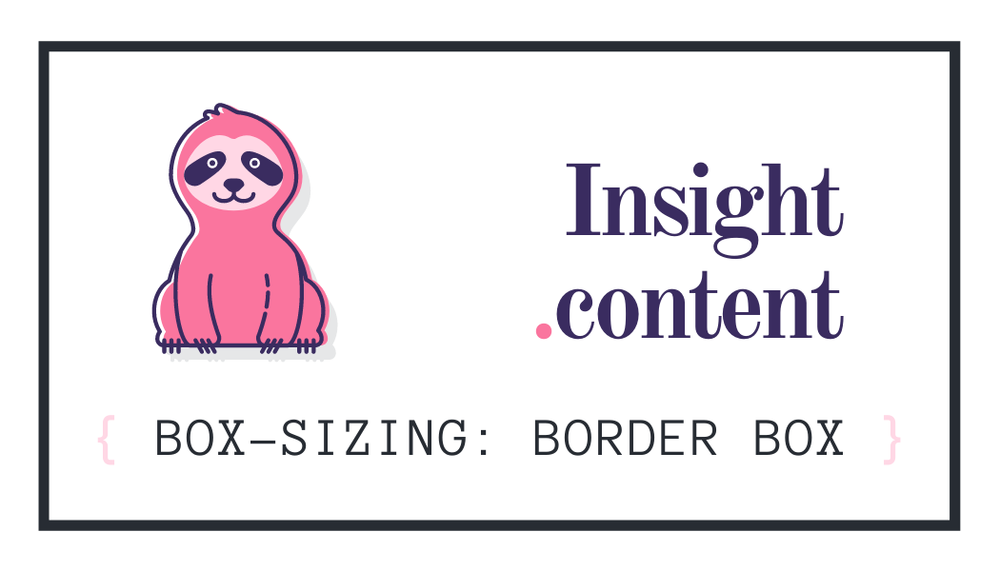

## Sobre o Projeto

Introdução à criação de página, combinando linguagens da web.

## Linguagens Utilizadas

## Primeira Versão

HTML e CSS básico com imagens e links estilizados.

## Inspiração

Modelo utilizado para atualização da página.

## Versão Atual

Atualização da página com novos aprendizados:
- HTML semântico e identado;
- CSS com flexbox e hover;
- Comentários nos códigos;
- CSS em ordem alfabética.

Falta implementar: Acessibilidade & Responsividade.