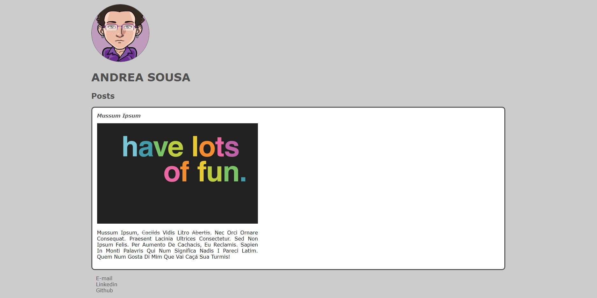
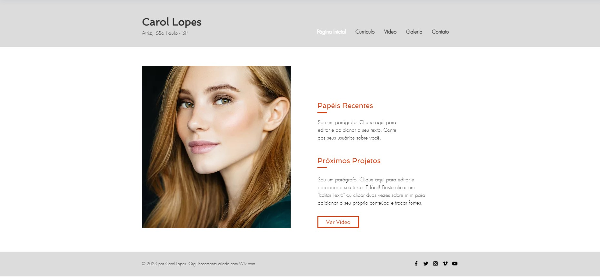
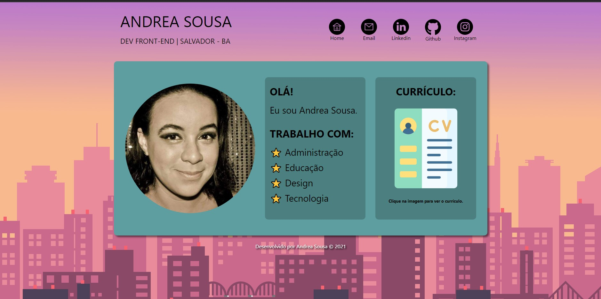

<h1 align="center">
    
</h1>

  :white_check_mark: <a href="https://andreadcsousa.github.io/dio_webpage_inicio/" target="_blank">Veja a página</a>&nbsp;&nbsp;&nbsp;|&nbsp;&nbsp;&nbsp;
  :white_check_mark: <a href="https://web.digitalinnovation.one/home" target="_blank">Conheça a DIO</a>

# :computer: Projeto

- Idealizador: Digital Innovation One
- Projeto: HTML Web Developer
- Lado da força: Front-End
- Tipo: Bootcamp Starter
- Etapa: Introdução ao HTML

# :clipboard: Apresentação

A partir do curso de `Introdução a criação de websites com HTML5 e CSS3`, montei minha primeira página.

👇 <ins><strong>3 meses depois:</strong></ins> 👇

Entendendo o que é _semântica_ e a sua importância, utilizei tags para dividir o corpo da página (header, main e footer) e definir o conteúdo principal (section e article). Utilizei a tag _img_ como plano de fundo da página, no menu de navegação (com links _blank_ embutidos) e antes da seção de apresentação. Organizei o menu com itens em uma _unordered list_, aplicando o layout de _flexbox_ para boa visualização em diferentes dispositivos. Optei por definir o tamanho das fontes em _rem_.

Na versão para PC, apliquei _hover_ no menu para destacar os itens ao passar do mouse e, também, inseri ícone como item de lista com _content_ ao tópicos da seção de preferências. Adicionei um _favicon_ semelhante ao ícone de estrela. Após concluir a página, criei outros dois arquivos CSS para aplicar os _media queries_ e fazer a página funcionar em dispositivos móveis. Com tudo pronto, organizei a _identação_, o CSS em ordem alfabética e inseri comentários aos códigos.

# :rocket: Tecnologias

Esse projeto foi desenvolvido com:

## :art: Primeira Versão

- HTML e CSS com imagens e links estilizados | Primeira página criada com passo-a-passo

## :art: Inspiração

- Modelo utilizado para atualização da página.

## :art: Versão Atual
 
- HTML semântico e identado | CSS com flexbox e em ordem alfabética | Comentários nos códigos

