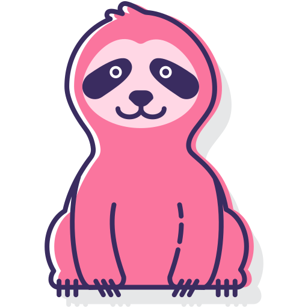

## Sobre o Projeto

- Introdução à criação de página, combinando linguagens da web.

## Linguagens Utilizadas

+ HTML5
+ CSS3

### Primeira Versão

- HTML e CSS básico;
- Imagens e links estilizados.

### Inspiração

- Modelo utilizado para atualização da página.

### Versão Atual

Atualização da página com novos aprendizados:
- HTML semântico e identado;
- CSS com flexbox e hover;
- Comentários nos códigos;
- CSS em ordem alfabética.

Falta implementar:
- Acessibilidade;
- Responsividade.

